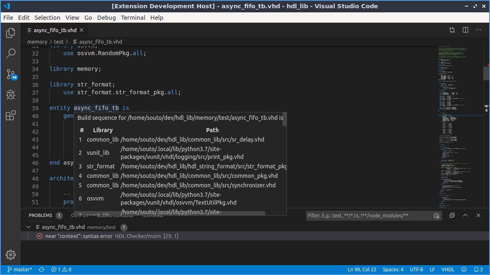
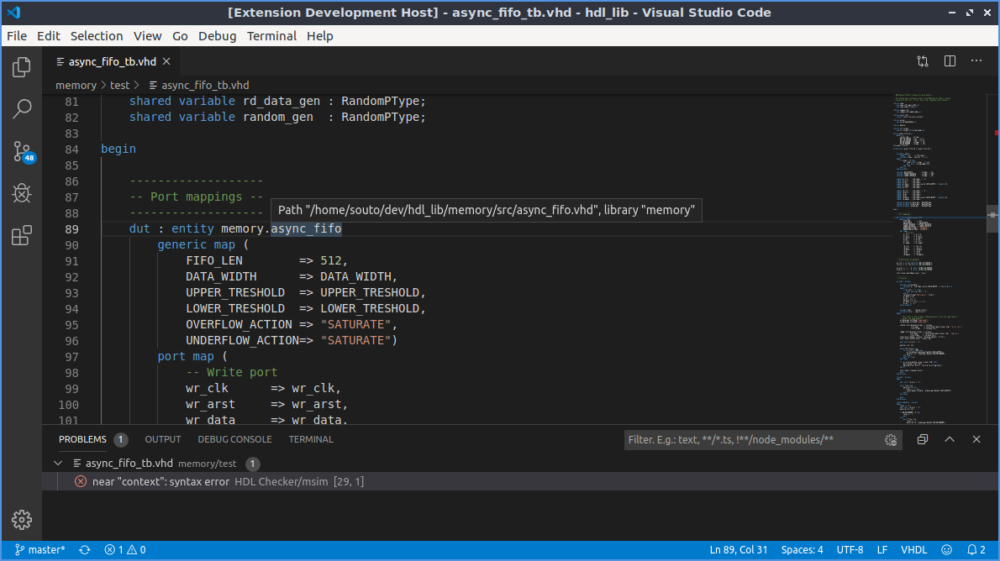
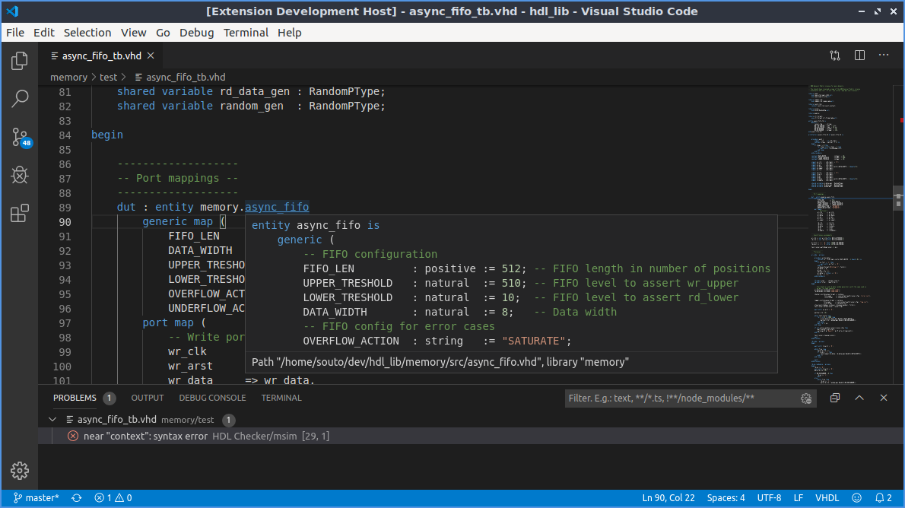

# HDL Checker VC Code client

Simple client for [HDL Checker][hdl_checker]

Please note that HDL Checker works best when paired with one of the [third party
supported tools][hdl_checker_supported_tools].

|                                                                                       |
| :---:                                                                                                                                                      |
| HDL Checker can infer the compilation sequence even without a project file. This sequence can also be inspected by hovering over the name of a design unit |

|                    |
| :---:                                                                              |
| Inferred libraries and files can be inspected by hovering over their instantiation |

|  |
| :---:                                             |
| Go to definition                                  |

## Installation

1. Install this extension either from this repository or from [Visual Studio
   Marketplace][hdl_checker_client_vs_marketplace].
1. Install [HDL Checker][hdl_checker]  

    ```sh
    pip install hdl-checker --upgrade
    ```

    or

    ```sh
    pip install hdl-checker --upgrade --user
    ```

    * When using `--user`, make sure `$HOME/.local/bin` on Linux (or equivalent)
      is in your `PATH` environment variable!
    * Make sure that you can execute `hdl_checker --version`
1. HDL Checker works best when paired with one of the
   [supported third party tools][hdl_checker_supported_tools]

## About HDL Checker

HDL Checker is a language server that wraps VHDL/Verilg/SystemVerilog
compilers/tools that aims to reduce the boilerplate code needed to set things up.
It supports [Language Server Protocol][LSP] or a custom HTTP interface; can infer
library VHDL files likely belong to, besides working out mixed language
dependencies, compilation order, interpreting some compilers messages and
providing some (limited) static checks.

[](https://github.com/suoto/hdl_checker_vscode)

[hdl_checker]: https://github.com/suoto/hdl_checker
[hdl_checker_supported_tools]: https://github.com/suoto/hdl_checker#third-party-tools
[hdl_checker_client_vs_marketplace]: https://marketplace.visualstudio.com/items?itemName=suoto.hdl-checker-client
[LSP]: https://en.wikipedia.org/wiki/Language_Server_Protocol
